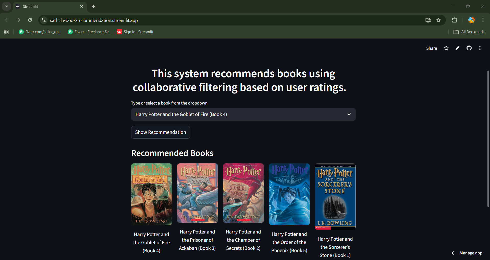

# Book Recommendation System

##  Project Description
A Machine Learning based book recommendation system that suggests books similar to the one selected by the user.  
The system uses **Collaborative Filtering** and **Cosine Similarity** to recommend books based on user ratings.

## Live Demo
https://sathish-book-recommendation.streamlit.app

## App Screenshot

---

## 📊 Dataset
The dataset contains information about **books, users, and ratings**.

Dataset source:
https://www.kaggle.com/datasets/ra4u12/bookrecommendation

---

##  Technologies Used

- Python
- Pandas
- NumPy
- Scikit-learn
- Streamlit
- Jupyter Notebook

---

## Machine Learning Model

The recommendation system uses:

**Collaborative Filtering with K-Nearest Neighbors (KNN)**  
to find books similar to the selected book.

---

##  How It Works

1. Load book, user, and rating datasets
2. Clean and preprocess the data
3. Create a **user-book rating matrix**
4. Apply **Cosine Similarity**
5. Use **KNN model** to find similar books
6. Display recommendations using **Streamlit UI**

---

## 📂 Project Structure

Book-Recommender-System-ML
│
├── assets
│ └── screenshot.png # App UI screenshot for README
│
├── artifacts # Saved ML model and processed files
│ ├── model.pkl
│ ├── book_names.pkl
│ ├── book_pivot.pkl
│ └── final_rating.pkl
│
├── data # Dataset used for training
│ ├── BX-Books.csv
│ ├── BX-Book-Ratings.csv
│ └── BX-Users.csv
│
├── notebooks # Jupyter notebook for experimentation
│ └── Book_Recommendation.ipynb
│
├── .streamlit # Streamlit configuration
│ └── config.toml
│
├── app.py # Main Streamlit application
├── requirements.txt # Python dependencies
├── runtime.txt # Python version for deployment
├── .python-version # Python version config
├── .gitignore
└── README.md

---

## ▶️ How to Run the Project

### 1️⃣ Clone the repository

### 2️⃣ Navigate to project folder

### 3️⃣ Install required libraries

### 4️⃣ Run the Streamlit app

---

##  Application Interface

The web interface allows users to:

- Select a book
- Get similar book recommendations
- View book cover images

---

##  Future Improvements

- Hybrid recommendation system
- Better UI design
- User login system

---

## 👨‍💻 Author

**Satheesh**

GitHub:  
https://github.com/sathishasmi

